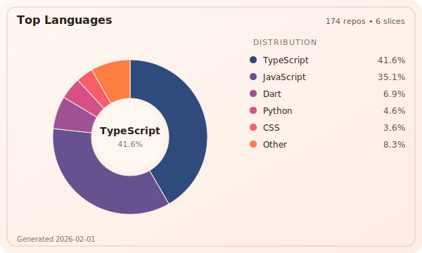

## 👋 Hi there, I'm Saad 👨🏻‍💻

               

🏦 Writing enterprise code by day.

🔎 Building tools and chasing ideas by night.

### 🛠️ GitHub Language Stats

_Generated using `npx @saadjs/gh-stats`_

_Checkout project [saadjs/gh-stats](https://github.com/saadjs/gh-stats)_

## 📫 Contact

[Website](https://www.saad.sh/)
