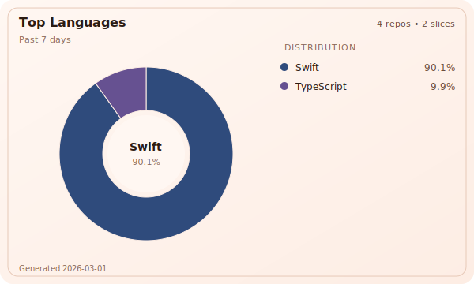

## 👋 Hi there, I'm Saad 👨🏻‍💻

                

🏦 Writing enterprise code by day.

🔎 Building tools and chasing ideas by night.

### 🛠️ GitHub Language Stats

| Past 7 days | All time |
| --- | --- |
|  |  |

_Generated using `npx @saadjs/gh-stats --source clone`_

_Checkout project [saadjs/gh-stats](https://github.com/saadjs/gh-stats)_

## 📫 Contact

[Website](https://www.saad.sh/)
